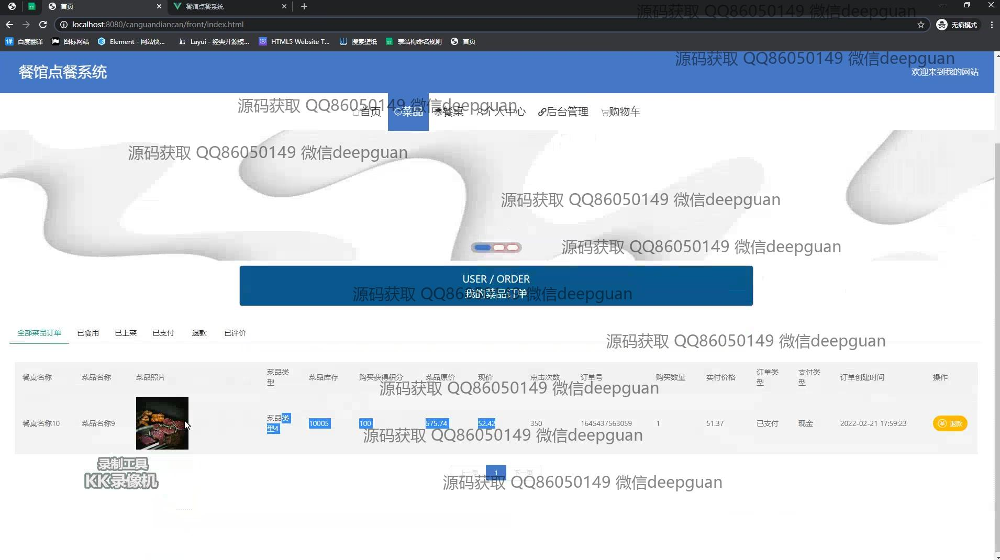
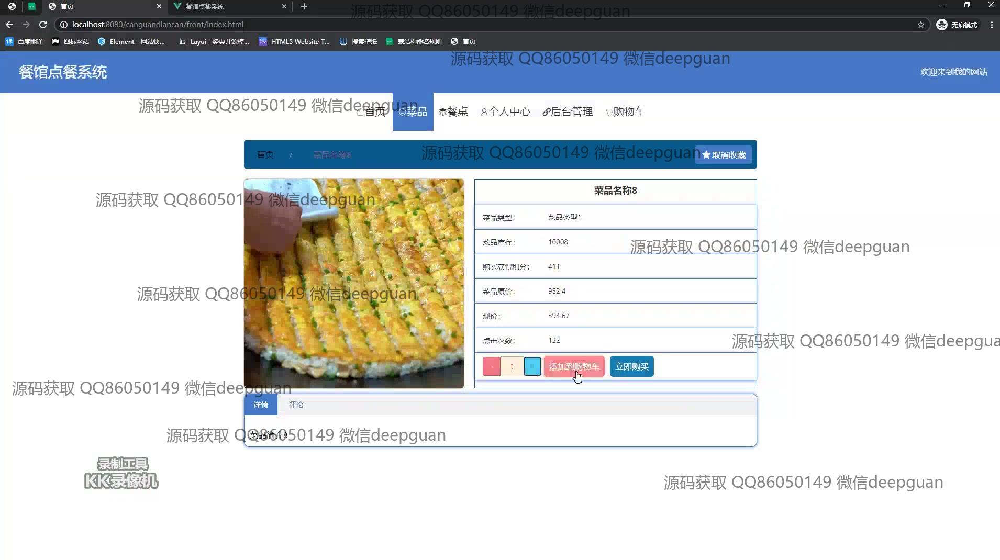
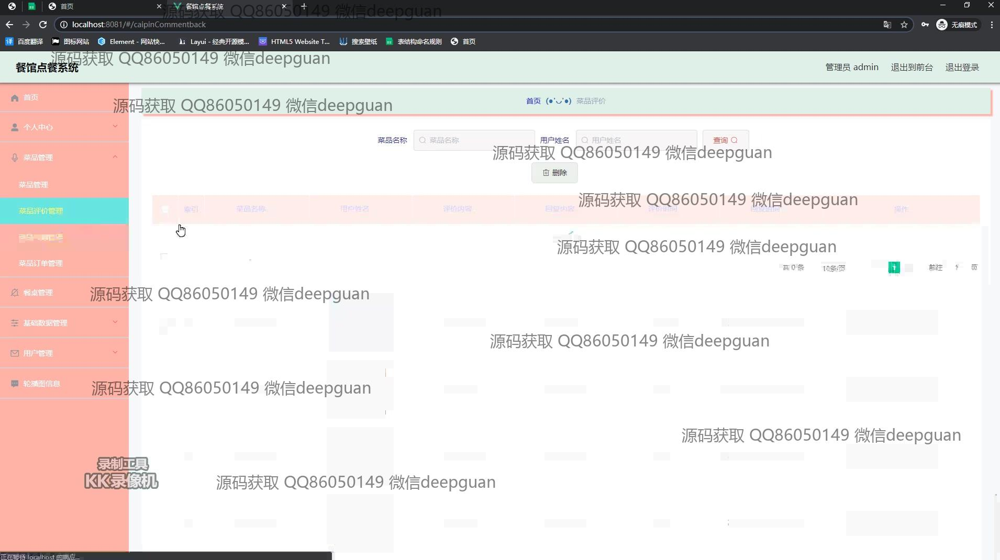

<h1 align="center">基于SSM框架的餐馆点餐系统的设计+vue</h1>

## 简介
餐馆点餐系统：角色分为管理员、用户；支持用户管理、菜品管理、餐桌管理、订单管理、评价管理等功能，采用前后台分离设计，操作简洁高效。    --计算机毕业设计源码；毕设源码；java毕业设计源码

## 联系方式

<h3 align="center">获取完整代码与数据库文件 + 微信：deepguan QQ: 86050149 QQ群: 783742310</h3>

<h3 align="center">可帮忙远程部署 包运行成功！提供远程部署、修改代码、设计文档指导、代码讲解等服务！</h3>

## 功能介绍（完整见运行截图）
管理员：管理员可以进行用户管理，包括查看和编辑账号信息、重置密码以及删除用户。菜品管理方面，管理员可以添加、编辑、删除菜品，管理库存并查看菜品评价。订单管理功能使管理员能够查看和操作订单详情，包括退款和上菜操作。此外，管理员还负责管理餐桌状态，包含预订和占用管理。系统的后台模块提供了丰富的数据管理和分析功能，提升餐厅运营效率。

用户：用户可以通过登录、注册和退出来访问系统。主导航栏帮助用户快速浏览不同功能模块，包括首页、菜品、餐桌、购物车和个人中心。用户可以查看和搜索菜品详情，将菜品加入购物车或直接购买。个人中心允许用户查看和更新个人信息、订单历史，并管理积分和会员等级。用户还可编辑个人评价，参与互动，提升用户体验。在餐桌模块，用户可以查看餐桌状态并进行预订。

## 运行截图

本代码来源于网络,仅供学习参考使用!

